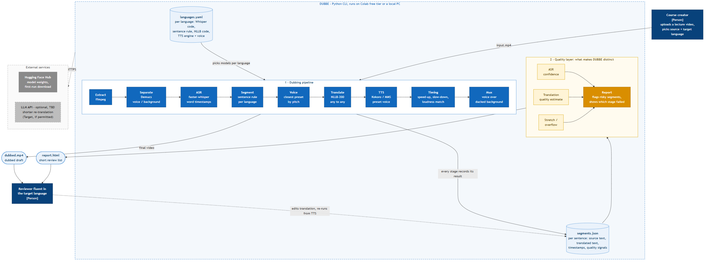

# DUBBE

### AI-Powered Video Translation & Dubbing

**DUBBE** turns a lecture or course video recorded in one language into a dubbed version in another — and tells you which sentences to double-check.

```
Video → ASR (word timestamps) → Sentence Segmentation → Translation → TTS → Timing → Dubbed Video
```

Every stage of a dubbing pipeline is a model, and errors compound: a misheard word becomes a confident mistranslation, then fluent synthesized speech that says something wrong. DUBBE's second output is a **quality report** that traces confidence through the chain and flags the segments a human should review. The result is a usable draft plus a short review list, not a black-box video.

**Applied AI & Business Capstone Design** · Inha University × HumbleBeeAI · Fall 2026 · Team 1 · Project tab **C2b – Video Translation and Dubbing**

## Architecture



Details: [docs/architecture.md](docs/architecture.md) (C4 Level 1 and 2, pipeline flow).

## Documents

- [Project overview](docs/project-overview.md) — problem, users, solution, Definition of Done and our plan, data, tools
- [Technical build plan](docs/project-plan.md) - step-by-step: stack, repo layout, data formats, each stage with commands and checks
- [Team roles and responsibilities](docs/team.md)
- [Question log](docs/questions.md) — open questions for instructors and mentors
- [Architecture — C4 Level 1 and 2](docs/architecture.md)
- [Data sources](docs/data-sources.md) — clips, licences, evaluation data, model licences
- [Test plan](docs/test-plan.md) — how each Definition of Done item is checked
- [Test results](docs/test-results.md) — what has actually been measured so far
- Ground rules, functional requirements — TBD

## Features and status (2026-10-06)

Tiers follow the project tab's Definition of Done. ✅ built and tested · 🟡 built, partly tested · ⬜ not started. Measured results: [docs/test-results.md](docs/test-results.md).

**Baseline**
- ✅ One command runs the whole pipeline: extract → separate → speech recognition with word timestamps → sentences → translation → speech synthesis (preset voice, no cloning) → timing → video
- ✅ Korean → English dub (tested on FLEURS read speech and a private TV clip)
- ✅ No progressive timing drift (drift check passes on all test clips)
- ⬜ Output quality rated by English speakers (needs raters, Q-007)

**Target**
- 🟡 Error propagation: review flags per stage built (`report.html`); the gold-set study (T-05/T-06) not started
- ✅ Long translations: shorter alternative wording + optional picture slow-down (`--slow-video 1.2`)
- 🟡 Second language pair: English → Korean runs (MMS voice); needs a fluent Korean rater and approval (Q-005)
- ⬜ Multiple speakers distinguished
- 🟡 Cost per minute vs. professional dubbing: computed for every run (`stats.json`, report, web page); price assumptions in `languages.yaml` still need sources

**Stretch / beyond the DoD**
- ✅ Background sound kept (music, effects, a phone ringing) under the new voice
- 🟡 Voice matching: preset voice chosen by the speaker's pitch register (single speaker; reviewer can override)
- ⬜ Expressive voice (intonation, emotion) — planned, [plan C9](docs/project-plan.md)
- Out of scope: voice cloning, lip sync

## Project structure

```
src/dubbe/          pipeline: one module per stage + cli.py, languages.yaml (all language settings)
tests/              unit tests for the logic that is easy to get wrong (pytest)
scripts/            test clip builder and the T-03 / T-12 / T-14 check scripts
docs/               overview, plan, architecture (C4), data sources, test plan and results, diagrams
data/  work/        local only (git-ignored): test videos, intermediate files and outputs
course/  archive/   local only (git-ignored): course PDFs, superseded drafts
```

## Team

| Member | Major | Role |
|---|---|---|
| Kalandarov Ulugbek | IBT | Team Representative / PM |
| Isokulov Azamat | IBT | Problem & Business |
| Samandarov Madina | IBT | Data & Research, User & Requirements |
| Musurmonov Jakhongir | IBT | Demo & Presentation |
| Tagaev Rashid | ISE | AI / Technical Lead |
| Kholmirzaev Temurjon | ISE | Software / IT Engineer |

Details in [docs/team.md](docs/team.md).

## Tech stack (all free, run locally)

ffmpeg · faster-whisper (Whisper large-v3-turbo) · NLLB-200 (distilled-600M) · Kokoro-82M and MMS-TTS · Demucs · Python 3.10–3.12

Starter template: [humblebeeai/module-python-template](https://github.com/humblebeeai/module-python-template) — chosen because DUBBE is a batch command-line pipeline and needs no HTTP API or database.

## Data

No video or audio files are stored in this repository. Full plan and licence rules in [docs/data-sources.md](docs/data-sources.md). Each test clip will be listed here with its source URL, licence, collection date, personal-data check, and preprocessing.

| Clip | Source | Licence | Date | Personal data | Preprocessing |
|---|---|---|---|---|---|
| FLEURS ko_kr dev, 12 sentences (`scripts/make_fleurs_clip.py`) | huggingface.co/datasets/google/fleurs | CC BY 4.0 | 2026-10-05 | Read speech by volunteers, published dataset | Concatenated with 1 s pauses, slides drawn with the text |
| Lecture clips | KOCW / K-MOOC / team-recorded (with consent) | Per clip; No-Derivatives licences rejected | TBD | | |

## Setup and run

Status: runs end to end on a local NVIDIA GPU (RTX 4060, 8 GB). Not yet tested from a fresh clone on a second machine (T-01) or on Colab (Q-004).

Requirements: ffmpeg on PATH; **Python 3.10–3.12** (Kokoro needs < 3.13); NVIDIA GPU recommended (CPU works, slower). First run downloads ~5 GB of model weights.

```bash
py -3.12 -m venv .venv && .venv/Scripts/activate   # Linux/macOS: python3.12 -m venv .venv && source .venv/bin/activate
# GPU: install CUDA PyTorch first (the default Windows torch is CPU-only); skip this line for CPU-only
pip install torch==2.8.0 torchaudio==2.8.0 torchvision==0.23.0 --index-url https://download.pytorch.org/whl/cu128
pip install -e ".[models,gui,dev]"
dubbe-gui                                       # simplest way to try it: local web page at http://127.0.0.1:7860
pytest                                          # unit tests: sentence grouping, timing
dubbe lecture.mp4 --src ko --tgt en             # -> work/lecture.ko-en/dubbed.mp4
                                                # + report.html: segments a human should check, and why
                                                # music/effects are kept under the new voice; --no-background = voice only
python scripts/background_check.py              # T-12: phone ring survives, no original voice leaks
python scripts/drift_check.py work/lecture.ko-en/segments.json   # T-03: timing drift PASS/FAIL
python scripts/make_fleurs_clip.py              # optional: Korean test clip with reference text (FLEURS, CC BY 4.0)
```

Every stage writes its result into `work/<video>.<src>-<tgt>/`. To correct a translation, edit `tgt_text` in `segments.json`, set `"edited": true`, and run `dubbe lecture.mp4 --from tts`.

## Credits

Problem statement and Definition of Done are from the HBAI Capstone Project Pool, tab C2b. Third-party models and their licences are listed in [docs/project-overview.md](docs/project-overview.md#8-tools-models-free-path-hardware). AI tools (Claude) were used to help draft and revise documentation; all content was reviewed by the team.
