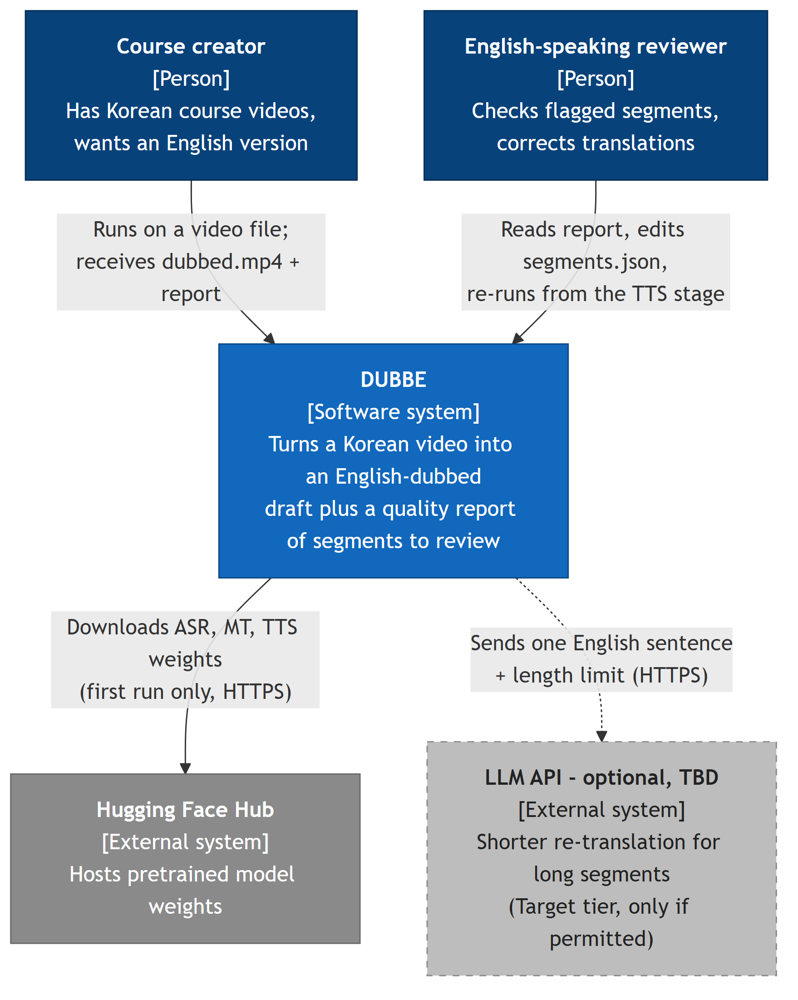
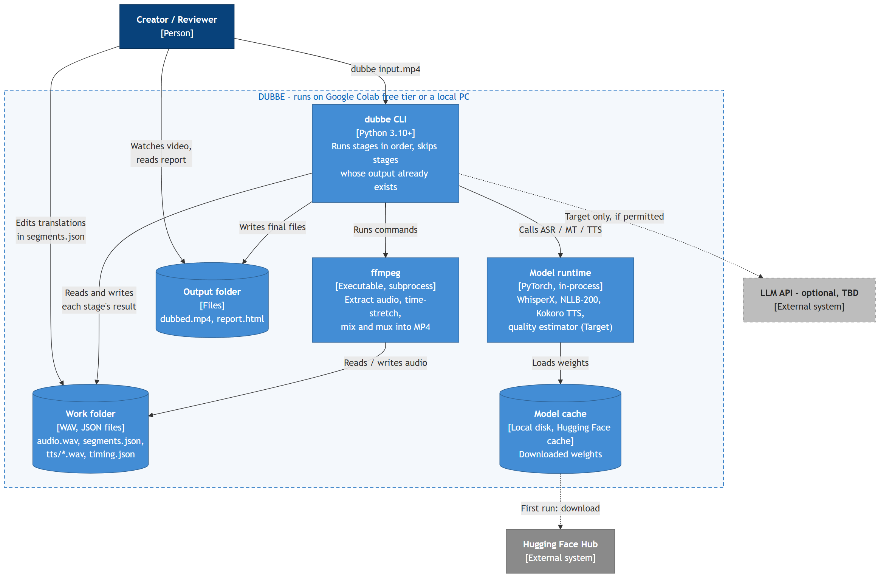
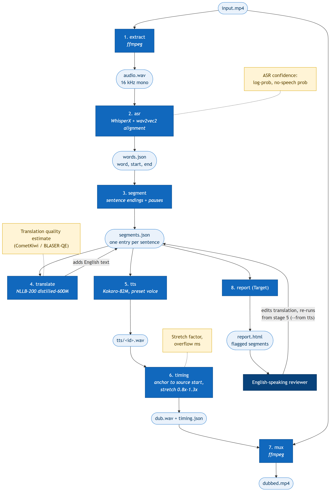

# DUBBE — Architecture (C4 Level 1 and 2, draft v1, 2026-09-23)

Initial design. It will change as the pipeline is built; undecided parts are marked **TBD**. Diagram images live in [diagrams/](diagrams/); each has an editable Mermaid source (`.mmd`) next to it. Re-render after editing: `npx @mermaid-js/mermaid-cli -i diagrams/<name>.mmd -o diagrams/<name>.png -b white -s 3`.

DUBBE is a **single Python command-line program** that runs a fixed chain of stages over one video. There is no server, web UI, or database: every stage reads and writes plain files, so each step can be inspected, edited, and re-run.

## C1 — System Context

Who uses DUBBE and what it connects to.

| Element | Type | Role |
|---|---|---|
| Course creator | Person | Primary user. Provides the source video (their own or openly licensed), receives the dubbed draft and the review list. |
| English-speaking reviewer | Person | Human-in-the-loop. Every AI output shown to users must be editable and approved (course rule). Can be the creator or someone they hire. |
| DUBBE | System (what we build) | ASR → segmentation → translation → TTS → timing → mux, plus per-segment quality signals. |
| Hugging Face Hub | External | Model download only. After the first run the pipeline works offline. |
| LLM API | External, optional | Not in Baseline. Used only if allowed and only for segments too long to fit their time slot. Must have a local fallback. |

**Not connected (on purpose):** no voice-cloning service, no paid dubbing API. ElevenLabs is used only as a *price reference* for the cost comparison, never called.

## C2 — Containers

What runs inside DUBBE and where data lives.

| Container | Technology | Responsibility |
|---|---|---|
| dubbe CLI | Python 3.10+, started from [module-python-template](https://github.com/humblebeeai/module-python-template) | Orchestrates the stages; each stage is a function that reads the previous file and writes its own. `--from <stage>` re-runs from a given stage after a human edit. |
| ffmpeg | ffmpeg ≥ 6 | All audio/video I/O: extract 16 kHz mono WAV, `atempo` time-stretch, place segments on the timeline, mux the new track with the original picture. |
| Model runtime | PyTorch; WhisperX, transformers (NLLB-200 distilled-600M), Kokoro-82M | ASR with word timestamps, translation, speech synthesis. Runs on Colab T4 GPU or CPU (TTS is CPU-friendly). |
| Work folder | Files | Intermediate results. `segments.json` is the single source of truth: one entry per sentence with source text, translation, times, and quality signals. |
| Output folder | Files | What the user receives: `dubbed.mp4` and `report.html` (flagged segments, per-stage breakdown). |
| Model cache | Files | Model weights; never committed to git. |

### Pipeline stages inside the CLI

This is a preview of C3, kept here because each stage's output file is what the [test plan](test-plan.md) checks.

| # | Stage | Input → output | Tool | Quality signal recorded |
|---|---|---|---|---|
| 1 | extract | `input.mp4` → `audio.wav` | ffmpeg | — |
| 2 | asr | `audio.wav` → `words.json` (word, start, end) | WhisperX + `kresnik/wav2vec2-large-xlsr-korean` alignment | ASR log-probability, no-speech probability |
| 3 | segment | `words.json` → `segments.json` (sentences) | Rules: Korean sentence endings + pause length; `kss` TBD | sentence length, pause-split vs. punctuation-split |
| 4 | translate | adds `en` to each segment | NLLB-200 distilled-600M | quality estimate (CometKiwi / BLASER-QE, Target) |
| 5 | tts | each `en` → `tts/<id>.wav` | Kokoro-82M, one preset voice | synthesized duration |
| 6 | timing | `tts/*.wav` → `dub.wav`, `timing.json` | ffmpeg `atempo`, silence padding | stretch factor, overflow (ms) |
| 7 | mux | `input.mp4` + `dub.wav` → `dubbed.mp4` | ffmpeg | — |
| 8 | report (Target) | `segments.json` → `report.html` | Python, plain HTML | combined review flag |

### Key design decisions

| Decision | Why | Revisit if |
|---|---|---|
| Files between stages, no database | One user, one video at a time; files are easy to inspect, edit, and diff | Batch processing of many videos is needed |
| Each segment anchored to its **source** start time | Prevents progressive drift (Baseline DoD) — an overlong segment cannot push later ones | — |
| Stretch limited to 0.8×–1.3×; beyond that the segment overflows into the next pause and is flagged | Project tab: beyond ~1.3× speech sounds wrong | Target: shorter re-translation instead of overflow |
| Local open models only for Baseline | Tab requires a free path without paid APIs or a dedicated GPU | Colab free tier cannot run the chain (Q-004) |
| Preset TTS voices, no cloning | Voice cloning is out of scope, including our own voices | — |
| Background music/noise is dropped (voice track only) | Keeps Baseline simple | Stretch: source separation (e.g. Demucs) |

### Error handling and fallbacks (initial)

- A stage fails → the CLI stops, keeps all earlier files, and prints which stage failed; re-running resumes from there.
- No GPU → ASR falls back to a smaller Whisper model on CPU (slower, lower accuracy; noted in the report).
- LLM API unavailable or not permitted → keep the NLLB translation and flag the segment as overflowing.

## Open questions

See [questions.md](questions.md): Q-003 (external API), Q-004 (Colab free tier capacity), Q-006 (review step: JSON edit vs. UI), Q-008 (Kokoro vs. XTTS-v2).
