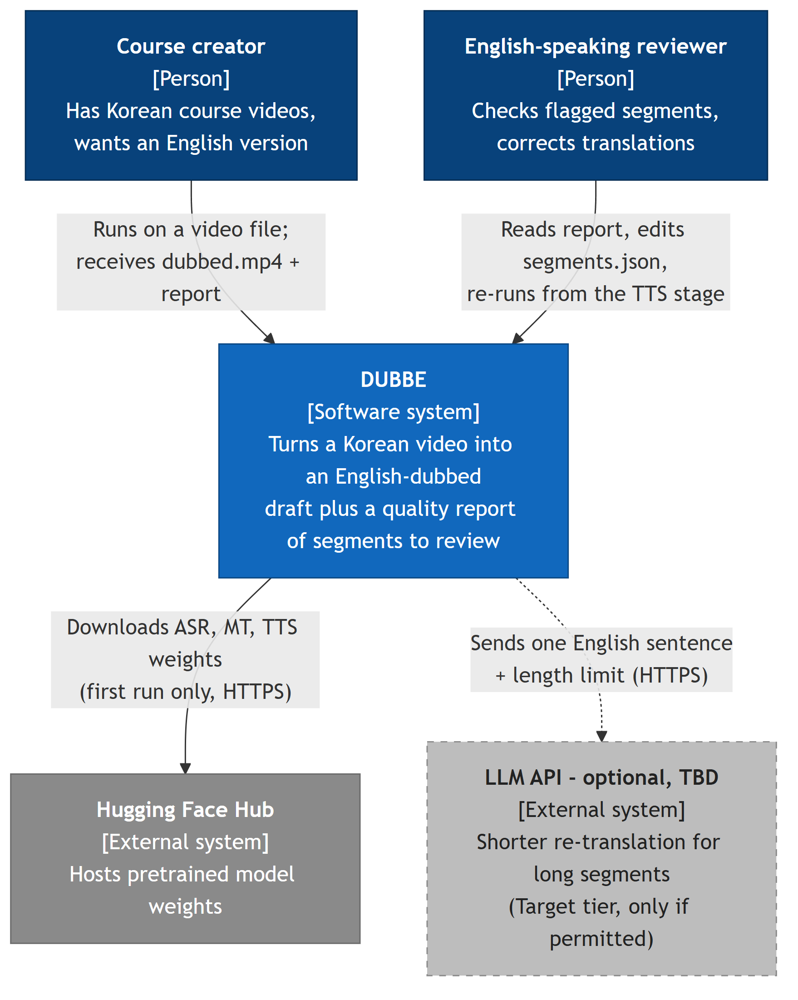
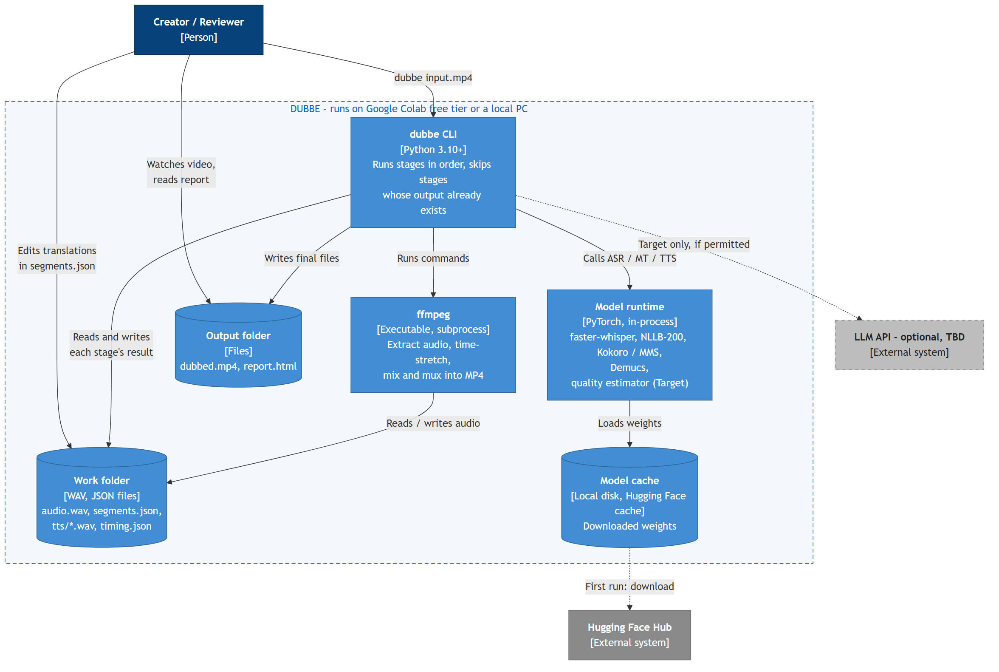
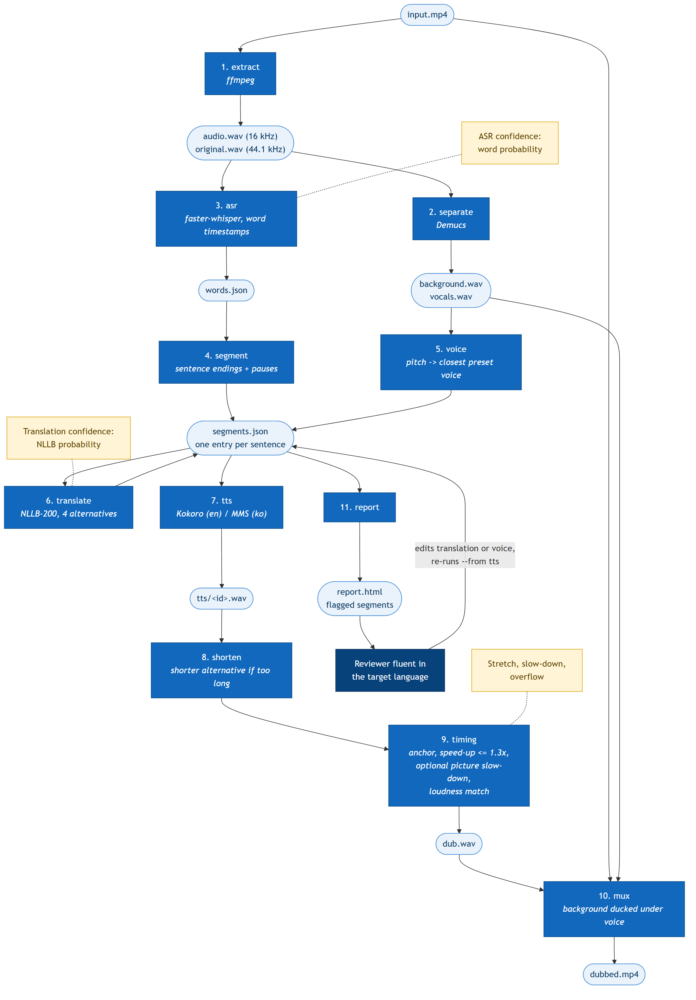

# DUBBE — Architecture (C4 Level 1 and 2, draft v1, 2026-09-23)

Initial design. It will change as the pipeline is built; undecided parts are marked **TBD**. Diagram images live in [diagrams/](diagrams/); each has an editable Mermaid source (`.mmd`) next to it. Re-render after editing: `npx @mermaid-js/mermaid-cli -i diagrams/<name>.mmd -o diagrams/<name>.png -b white -s 3`.

DUBBE is a **single Python command-line program** that runs a fixed chain of stages over one video. There is no server, web UI, or database: every stage reads and writes plain files, so each step can be inspected, edited, and re-run.

## Main architecture overview


## C1 — System Context

Who uses DUBBE and what it connects to.



| Element | Type | Role |
|---|---|---|
| Course creator | Person | Primary user. Provides the source video (their own or openly licensed), receives the dubbed draft and the review list. |
| English-speaking reviewer | Person | Human-in-the-loop. Every AI output shown to users must be editable and approved (course rule). Can be the creator or someone they hire. |
| DUBBE | System (what we build) | ASR → segmentation → translation → TTS → timing → mux, plus per-segment quality signals. |
| Hugging Face Hub | External | Model download only. After the first run the pipeline works offline. |
| LLM API | External, optional | Not in Baseline. Used only if allowed and only for segments too long to fit their time slot. Must have a local fallback. |

**Not connected (on purpose):** no voice-cloning service, no paid dubbing API. ElevenLabs is used only as a *price reference* for the cost comparison, never called.

## C2 — Containers

What runs inside DUBBE and where data lives.



| Container | Technology | Responsibility |
|---|---|---|
| dubbe CLI | Python 3.10+, started from [module-python-template](https://github.com/humblebeeai/module-python-template) | Orchestrates the stages; each stage is a function that reads the previous file and writes its own. `--from <stage>` re-runs from a given stage after a human edit. |
| ffmpeg | ffmpeg ≥ 7 | All audio/video I/O: extract audio, `atempo` time-stretch, duck the background under the new voice, slow the picture where needed, mux. |
| Model runtime | PyTorch; faster-whisper, NLLB-200 (transformers), Kokoro-82M + MMS-TTS, Demucs | ASR, translation, speech synthesis, source separation, pitch analysis. One model on the GPU at a time (8 GB is enough). |
| Work folder | Files | Intermediate results. `segments.json` is the single source of truth: one entry per sentence with source text, translation, times, and quality signals. |
| Output folder | Files | What the user receives: `dubbed.mp4` and `report.html` (flagged segments, per-stage breakdown). |
| Model cache | Files | Model weights; never committed to git. |

### Pipeline stages inside the CLI

This is a preview of C3, kept here because each stage's output file is what the [test plan](test-plan.md) checks.



| # | Stage | Input → output | Tool | Signal recorded |
|---|---|---|---|---|
| 1 | extract | `input.mp4` → `audio.wav` (16 kHz mono), `original.wav` (44.1 kHz stereo) | ffmpeg | — |
| 2 | separate | `original.wav` → `background.wav`, `vocals.wav` | Demucs `htdemucs` | background dropped if > 35 dB below the original (only residue) |
| 3 | asr | `audio.wav` (original mix) → `words.json` | faster-whisper `large-v3-turbo`, words over silence dropped | word probability (`asr_conf`) |
| 4 | segment | `words.json` → `segments.json` | sentence endings + pause lengths per language | — |
| 5 | voice | `vocals.wav` → speaker pitch → closest preset voice | torchaudio pitch, voice library in `languages.yaml` | pitch register, chosen voice |
| 6 | translate | adds `tgt_text` + 4 alternatives | NLLB-200 distilled-600M, 8 beams | `mt_conf` (model's own probability) |
| 7 | tts | each sentence → `tts/<id>.wav` | Kokoro-82M (English), MMS-TTS (Korean) | duration |
| 8 | shorten | too-long sentences → shorter alternative, re-synthesized | NLLB alternatives | `shortened` |
| 9 | timing | `tts/*.wav` → `dub.wav` | anchor to source start; speech ≤ 1.3× faster; optional picture slow-down; loudness matched to the original voice | `stretch`, `slow`, `overflow` |
| 10 | mux | `input.mp4` + `dub.wav` (+ `background.wav`) → `dubbed.mp4` | ffmpeg; background ducked under the voice; video re-encoded only if slowed | — |
| 11 | report | `segments.json` → `report.html` | plain HTML | flags: `low_asr`, `low_mt`, `overflow` |

### Multi-language design (many → many)

DUBBE is built for any source → any target language; the capstone builds and tests **Korean → English** first and **one second pair** (Target). Language-specific choices live in **one config file**, `languages.yaml`, never in stage code. Adding a language = adding one entry + one test clip + one fluent rater.

```yaml
ko:
  whisper: ko
  nllb: kor_Hang
  tts: {engine: mms, voice: facebook/mms-tts-kor}
  sentence_end: "[.?!]|다$|요$|까$"
en:
  whisper: en
  nllb: eng_Latn
  tts: {engine: kokoro, voice: af_heart}
  sentence_end: "[.?!]"
```

Usage: `dubbe input.mp4 --src ko --tgt en` (or `--src auto`, using Whisper's language detection).

| Stage | Scales by | Coverage | Limit |
|---|---|---|---|
| ASR | Whisper language code | 99 languages, word timestamps for all | Accuracy varies by language |
| Segment | `sentence_end` rule per language | Any | Languages without punctuation-like endings fall back to pauses |
| Translate | NLLB language code | 200, any direction, no English pivot | Quality varies by pair; non-commercial licence (see data-sources.md) |
| TTS | Engine + voice per language | Kokoro 8 languages (no Korean; used for English), MMS-TTS 1,100+ (non-commercial; used for Korean) | **Main bottleneck** — one adapter function per TTS engine, not per language |
| Quality report | Reference-free metrics | CometKiwi / BLASER cover 100+ languages | — |
| Human rating | A fluent rater per target language | — | **Real limit** — cannot be automated |

Only one kind of change touches code: a new **TTS engine** (one small function in `tts.py`). Everything else is config.

### Key design decisions

| Decision | Why | Revisit if |
|---|---|---|
| Files between stages, no database | One user, one video at a time; files are easy to inspect, edit, and diff | Batch processing of many videos is needed |
| Each segment anchored to its **source** start time | Prevents progressive drift (Baseline DoD) — an overlong segment cannot push later ones | — |
| Stretch limited to 0.8×–1.3×; beyond that the segment overflows into the next pause and is flagged | Project tab: beyond ~1.3× speech sounds wrong | Target: shorter re-translation instead of overflow |
| Local open models only for Baseline | Tab requires a free path without paid APIs or a dedicated GPU | Colab free tier cannot run the chain (Q-004) |
| Language choices in `languages.yaml`, not in code | Many-to-many is the product goal; adding a language must not require changing stages | — |
| ASR = faster-whisper's own word timestamps, VAD filter off | Tested on FLEURS Korean: WhisperX's wav2vec2 alignment found 3/11 sentence pauses and put 5% of speech inside silences; faster-whisper found 11/11 with 0%. VAD filter and previous-text conditioning each skipped a whole sentence | Accuracy problems on real lectures |
| Preset TTS voices, no cloning | Voice cloning is out of scope, including our own voices | — |
| Background kept by source separation; ASR still reads the original mix | Phone ring survives at 0.0 dB, no voice leak (T-12); ASR on the separated voice had 2× the errors (CER 19.8 % vs 9.5 %) | — |
| Dub voice loudness matched to the original voice | Generated voices come out at their own level and buried the music (17.5 dB vs 11.5 dB under the voice) | — |
| Picture may slow down where the dub is longer (`--slow-video`, off by default) | Max speech speed-up 1.30× → 1.18× on the en→ko test; invisible on slides, visible on action | — |
| Voice matching by pitch register; a preset's own label decides its group | 95 % register agreement on FLEURS; raw pitch alone crossed perceived voice type | Emotional or multi-speaker scenes (needs C7) |

### Error handling and fallbacks (initial)

- A stage fails → the CLI stops, keeps all earlier files, and prints which stage failed; re-running resumes from there.
- No GPU → every model runs on CPU (Whisper in int8); slower, same results.
- No real background in the source → voice-only mix (`--no-background` forces this).
- LLM API unavailable or not permitted → keep the NLLB translation and flag the segment as overflowing.

## Open questions

See [questions.md](questions.md): Q-003 (external API), Q-004 (Colab free tier capacity), Q-006 (review step: JSON edit vs. UI), Q-008 (Kokoro vs. XTTS-v2), Q-009 (expression transfer and voice matching without cloning).
