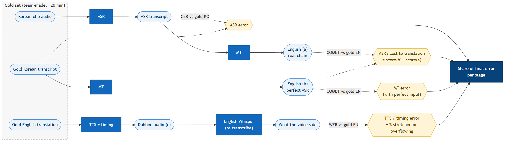

# DUBBE — Test Plan (draft v1, 2026-09-23)

How we will check each Definition of Done item from project tab C2b. Owner of criteria: Data & Research; each feature owner runs the tests for their own stage. Thresholds marked **TBD** are first proposals to confirm once we see real output.

## Test environment

- Google Colab free tier (T4 GPU) and one team laptop (CPU only) — the Baseline must work on both (Q-004).
- Test clips and gold set: see [data-sources.md](data-sources.md).
- Every test run records: date, git commit, clip ID, environment, and result, in `docs/test-results.md` (created when the first test runs).

## 1. Stage checks (while building)

Quick checks that each stage produced a sane file. Run on one 2-minute clip after every change to that stage.

| Stage | Check | Pass when |
|---|---|---|
| extract | `audio.wav` exists | 16 kHz mono, duration = video duration ± 0.1 s |
| asr | `words.json` | Every word has start < end; times increase; last word ends before audio end |
| segment | `segments.json` | Every word belongs to exactly one segment; no segment longer than ~20 s (TBD) |
| translate | `en` field | Every segment has non-empty English text; no Korean characters left |
| tts | `tts/<id>.wav` | One file per segment, non-silent |
| timing | `timing.json` | Stretch factor per segment within 0.8–1.3, or segment flagged as overflow |
| mux | `dubbed.mp4` | Plays; has one video + one audio stream; duration = source ± 0.5 s |

Automated unit tests (pytest) only for the pure logic that is easy to get wrong: **sentence grouping** and **timing placement**. Model stages are checked by the table above, not unit-tested.

## 2. Baseline tests

| ID | DoD item | How we test | Pass criterion |
|---|---|---|---|
| T-01 | Full pipeline end to end | Fresh clone → follow README → run `dubbe` on clips C01–C03 and T01 | Finishes without manual steps and produces `dubbed.mp4` for all 4 clips |
| T-02 | Watchable dubbed video (KO → EN) | 2+ English-speaking raters watch each full clip and score *watchability* 1–5 | Mean ≥ 3 per clip (TBD) |
| T-03 | No progressive drift over several minutes | From `timing.json`: offset = dubbed segment start − source segment start, for every segment of a ≥ 5-min clip; plot offset over time | No segment starts > 0.5 s late (TBD) **and** offsets in the last minute are not larger than in the first minute |
| T-04 | Quality assessed by a target-language speaker | Raters score a sample of segments with the rubric below | Rubric completed by ≥ 2 raters for ≥ 30 segments; results in the README |

### Rating rubric (per segment)

| Criterion | Scale | Question to the rater |
|---|---|---|
| Adequacy | 1–5 | Does the English say what the Korean lecture meant? (Rater sees our gold English translation if they don't speak Korean.) |
| Fluency | 1–5 | Is it natural, understandable English? |
| Timing | OK / not OK | Does the voice fit the moment on screen (slide, gesture)? |
| Error? | none / wrong word / wrong meaning / missing / mispronounced / cut off | What went wrong, if anything |

Per clip: overall *watchability* 1–5 and one free-text comment. Raters are anonymous IDs (R1, R2, …).

## 3. Target tests

How T-05 and T-06 separate each stage's share of the final error:

| ID | DoD item | How we test | Measure |
|---|---|---|---|
| T-05 | Error propagation: where quality breaks down | On the gold set run the chain three ways: **(a)** ASR → MT, **(b)** gold transcript → MT, **(c)** gold translation → TTS. Compare quality of (a) vs (b) to isolate ASR's contribution; (b) vs. gold translation for MT's; (c) with the timing log for TTS/timing's | ASR: CER vs. gold transcript. MT: COMET vs. gold translation for (a) and (b). TTS: re-transcribe the dubbed audio with English Whisper, WER vs. the text it was asked to say. Timing: % segments stretched or overflowing |
| T-06 | Stage-by-stage breakdown of a failed segment (demo step 4) | For every segment a rater marked as an error, inspect `segments.json` and label the first stage that went wrong | Share of errors caused by each stage (e.g. "ASR 45 %, segmentation 20 %, MT 25 %, timing 10 %") |
| T-07 | Review flags are useful | Compare DUBBE's flagged segments with the segments raters marked as errors | Precision and recall of flags. Target: the flagged list catches most rater-marked errors while being much shorter than the full clip (TBD) |
| T-08 | Timing when translation is much longer/shorter | Count segments needing > 1.3× or < 0.8×; apply the fallback; re-rate timing on those segments | % segments within limits before vs. after; timing-OK rate on those segments |
| T-09 | Second language pair | Repeat T-01, T-02, T-04 for the second pair | Same criteria; language TBD (Q-005) |
| T-10 | Multiple speakers distinguished | Team clip T02 with two speakers | Each segment gets the right speaker label ≥ 90 % (TBD); two distinct voices in output |
| T-11 | Cost per minute vs. professional dubbing | Record wall-clock time per minute of video on Colab and CPU; convert to a GPU-hour price; compare with ElevenLabs ($0.33–2.20/min) and human dubbing quotes | Cost table + one honest sentence on the quality gap, using T-02/T-04 scores |

**Sanity benchmark before the gold set exists:** run T-05's ASR and MT parts on FLEURS Korean test sentences (read speech, so expect better numbers than on lectures).

## 4. Regression and reproducibility

- Before each submission: repeat T-01 from a fresh clone and T-03 on one long clip.
- Keep one frozen output (`segments.json` + scores) per clip in the results log, so a change that makes quality worse is visible.
- Model versions and seeds are pinned in the dependency file.

## 5. Schedule and owners (initial)

| When | What | Owner |
|---|---|---|
| Week 3–4 | Stage checks on one 2-min clip in Colab (environment spike) | Rashid, Temurjon |
| Week 4–5 | Select clips, write consent form, start gold set | Madina + IBT members |
| Week 6 | T-01, T-03 | Temurjon |
| Week 7 | T-02, T-04 rating round 1 (before mid-course review) | Madina, raters |
| Week 8–10 | T-05 to T-08 | Rashid, Madina |
| Week 10–11 | T-09 to T-11 (as time allows) | Rashid, Azamat (T-11) |
| Week 12+ | Regression + final rating round | All |

## 6. Known limits of this plan

- Team members are not professional translators; the gold translation will have its own errors. A second member checks each gold segment to reduce this.
- Few raters → scores show clear failures, not small differences. We will report the number of raters with every score.
- FLEURS is read speech; it does not predict lecture performance. It is only a sanity check.
- Automatic metrics (CER, COMET) do not capture timing or voice naturalness; that is why human rating is part of the Baseline.
